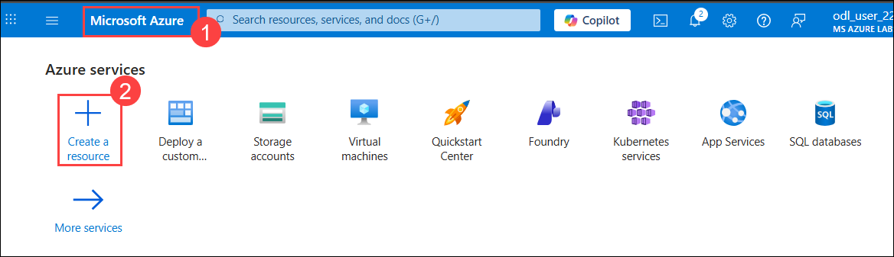
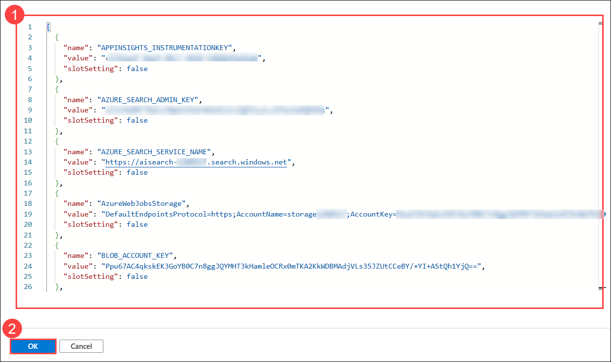
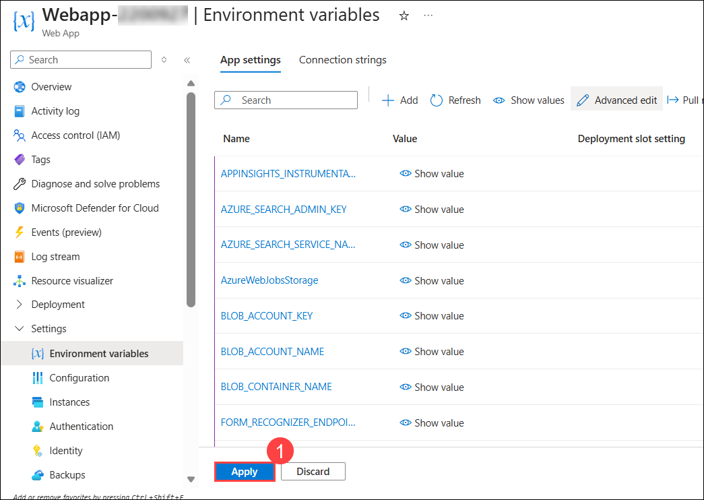
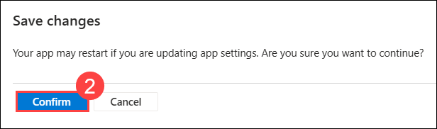
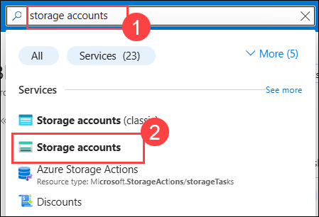
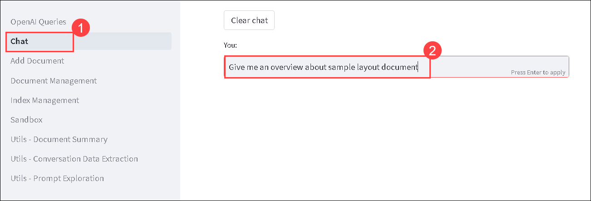
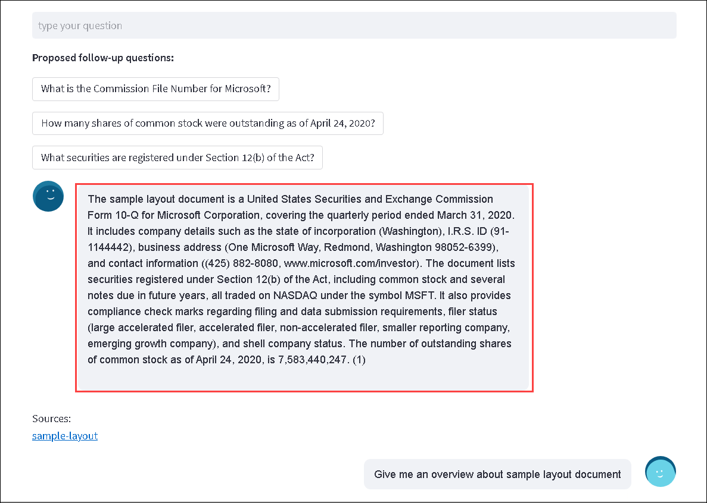
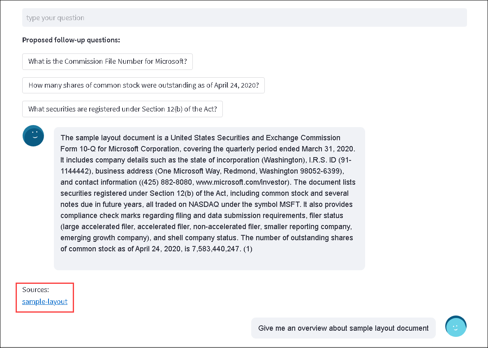
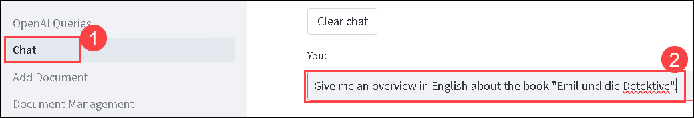
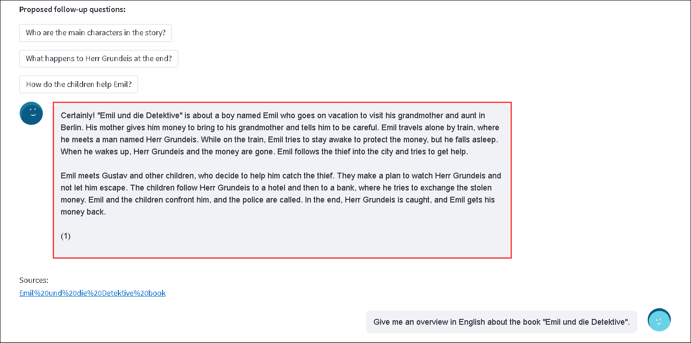

# Exercise 2: Query and retrieval

#### Estimated Duration: 120 Minutes

## Overview 

In this exercise, you will create and deploy a web application from a Docker image in Azure, configure environment variables, and test the deployment.

## Objectives

In this exercise, you will complete the following tasks:

- Task 1: Create and deploy a web app from a Docker image
- Task 2: Add environment Variables and check the Docker deployment
- Task 3: Test the web app

### Task 1: Create and deploy a web app from a Docker image

In this task, you will create a new Azure Web App resource. The web app will be set up to use a Docker container from a specified image. You will configure the app with settings for subscription, resource group, and Linux plan, and then deploy the Docker image **fruocco/oai-embeddings:latest** to the web app.

1. Navigate to the Home page of Azure portal by clicking on the **Microsoft Azure (1)** button, and select **+ Create a resource (2)**.

    

1. In the search box, type **Web app (1)**, select **Web App (2)** from the list of results, click on **Create (3)** and click on **Web App (4)**.

    

1. On the **Basics** tab of **Create Web App** resource page, enter the following details and click on **Next : Database > (9)** button.
   
    - Subscription: **Default - Pre-assigned subscription (1)**
    
    - Resource group: Select **Openai-embedded-<inject key="Deployment ID" enableCopy="false"></inject> (2)**
    
    - Name: **Webapp-<inject key="Deployment ID" enableCopy="false"></inject> (3)**

    - Secure a unique default hostname: **Turn off (4)**
    
    - Publish: Choose **Container (5)**
   
    - Operating System: Choose **Linux (6)**
   
    - Region: Select **<inject key="Region" enableCopy="false" /> (7)**

    - Linux Plan: Select an existing plan i.e. **hostingplan-<inject key="Deployment ID" enableCopy="false"></inject> (B3)**  **(8)**

      

1. On the **Database** tab, keep the default settings and click on **Next : Container >**.

1. On the **Container** tab, enter the following details and click on **Review + create (4)** button.

   - Image Source: Select **Other container registries (1)**

   - Access Type: Select **Public (2)**

   - Image and tag: Enter **fruocco/oai-embeddings:latest (3)**

     

1. On the **Review + create** tab, review the configuration, and click on **Create** button.

    

1. Once the deployment is complete, click on the **Go to resource** button.
   
    

## Task 2: Add environment Variables and check the Docker deployment

In this task, you will configure the necessary environment variables. This involves accessing the environment variables section in the web app settings, editing the values to match those provided in the previous exercise, and saving the changes.

1. On the Web App page, in the left-hand menu, select **Environment variables (1)** under **Settings** section and click on **Advanced edit (2)** at the top of the page to view or modify the environment variables.

    

1. In the advanced editor, delete the current values and paste the new values you copied from the Function App **(1)** in the previous exercise. Then, click **OK (2)**.

    

1. Click on **Apply (1)** and then select **Confirm (2)** to save the changes.

    

    

### Task 3: Test the web app

In this task, you will test the functionality of the deployed web app by browsing it through the Azure Portal.

1. Now, go to the **Overview** of the Azure Web App, and click on **Browse (2)** to open the web app.

    .png)

    > **Note:** If you encounter any errors while opening the web app, restart the web app, wait for 2-3 minutes, and then try again.

1. After the cold-start delay while your app's Docker image loads and starts, you'll see a page like the following image:

    .png)

1. In the left-hand menu, select **Add Document (1)** and then click on **Browse files (2)**.

    .png)

1. Navigate to `C:\LabFiles` **(1)**, select **sample-layout (2)** file and click **Open (3)**.

    

1. Once the file is uploaded, you'll see a page like the following image:

    .png)

1. To confirm, in the Azure Portal, type **Storage accounts (1)** in the search box and select **Storage accounts (2)** from the results.

    

1. On the **Storage center | Blob Storage** page, select **storage<inject key="Deployment ID" enableCopy="false"></inject>**.

    

1. In the left-hand menu, select **Containers (2)** under **Data storage (1)** section and open the **documents (3)** container.

    

1. Verify that the **sample-layout** file has been added to this container. You should also see a folder named **converted**, which contains the text version of the file processed by the Azure Functions.

    

    

1. Return to the web app page, click on **Chat (1)** and ask a question related to the **sample-layout** file. Below is a sample question **(2)** you can ask:

    ```
    Give me an overview about sample layout document
    ```

    

        

    >**Note:** The provided screenshot is for your reference; the output you receive may vary.

1. You can click on **Sources** to obtain the converted file in text format.

    

    

1. From the LabVM, open **File Explorer** by selecting its icon on the Windows Taskbar.

    

1. Navigate to `C:\LabFiles` **(1)** and double-click on the `Emil und die Detektive book` **(2)** file to open it.

    

1. Once the file is opened, verify that it is in the **German language**. We will then use the web app to translate the file into English and obtain the results using OpenAI Chat.

1. Return to the web app page, in the left-hand menu, select **Add Document (1)**, check the box for **Translate document to English (2)** and then click on **Browse files (3)**.

    
    
1. Navigate to `C:\LabFiles` **(1)**, select **Emil und die Detektive book (2)** file and click **Open (3)**.

    

1. Once the file is uploaded, you'll see a page like the following image:

    

1. To confirm, return to the **storage<inject key="Deployment ID" enableCopy="false"></inject>** and open the **documents** container. Verify that the **Emil und die Detektive book** file has been added to this container. You should also see a folder named **converted**, which contains the text version of the file processed by the Azure Functions.

    

    

1. Return to the web app page, click on **Chat (1)** and ask a question related to the **Emil und die Detektive book** file. Below are the questions **(2)** you can ask:

    ```
    Give me an overview in English about the book "Emil und die Detektive".
    ```

    

    

    ```
    What is the name of the main character in the book?
    ```

    

    >**Note:** The provided screenshot is for your reference; the output you receive may vary.

    ### How the File Translation is Managed?

    - The end-to-end process of managing and querying a knowledge base using Azure services. The workflow includes the following key steps:

        - **Knowledge Base Storage:**
            - **Azure Storage:** Stores unstructured documents such as PDFs, DOCX, and TXT files, providing a scalable and secure repository.

        - **Data Extraction:**
            - **Azure Document Intelligence:** Automatically extracts paragraphs and dialogues from the raw documents, converting unstructured data into structured formats for further processing.
            
            - **Azure Translator:** Translates extracted text into the desired language, ensuring the system can handle multilingual queries and documents.

        - **Text Embedding and Indexing:**
            - **Azure OpenAI Service Embeddings:** Converts the extracted text into high-dimensional vectors, encapsulating semantic meaning and context.
            
            - **Azure AI Search:** Indexes these embeddings, enabling fast and efficient vector-based searches across the knowledge base.

        - **Search and Answering:**
            - **Vector Search:** Uses Azure OpenAI Embeddings to perform a semantic search, matching user queries to the most relevant documents based on vector similarity.
            
            - **Azure AI Search:** Retrieves the top k relevant paragraphs from the indexed documents.

            - **Azure OpenAI Answering Prompt:** Constructs a concise and contextually accurate response from the retrieved paragraphs. If required, answers can be translated back to the user's preferred language.

1. You can click on **Sources** to obtain the converted file in text format.

    

    

> **Congratulations** on completing the task! Now, it's time to validate it. Here are the steps:
> - If you receive a success message, you can proceed to the next task.
> - If not, carefully read the error message and retry the step, following the instructions in the lab guide. 
> - If you need any assistance, please contact us at cloudlabs-support@spektrasystems.com. We are available 24/7 to help you out.
<validation step="0235891a-6654-4d5d-82b8-af3b6a5346e0" />

## Summary

In this exercise, you have accomplished the following:

- Created and deployed a web app from a Docker image
- Added environment variables and checked the Docker deployment
- Tested the web app

### You have successfully completed the lab.

By completing this lab **Enterprise Knowledge Base Search and Query with Azure OpenAI and Azure AI Search**, you gained practical experience in building intelligent search solutions powered by Azure’s AI services. You began by generating document embeddings with Azure OpenAI to capture semantic meaning and improve search relevance. You then implemented an advanced query and retrieval system using Azure AI Search, enabling efficient semantic search across the enterprise knowledge base. Additionally, you worked with Document Intelligence to extract structured data from documents and Translator to break language barriers, enhancing accessibility for global users. Finally, you automated the pipeline with Azure Functions, streamlining tasks such as document extraction, translation, embedding creation, and query handling. Through this integrated workflow, you developed a scalable knowledge search system that combines natural language understanding, multilingual support, and AI-driven insights to deliver accurate, context-aware results.
